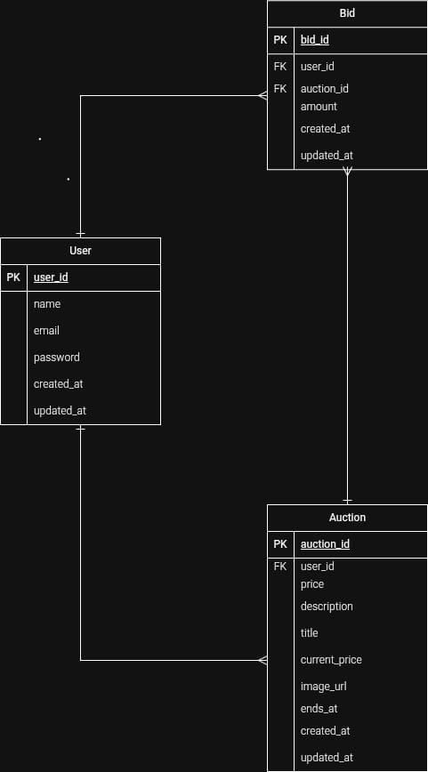

Identitas Kelompok:
1. I Kadek Reyfian Ditya Dwiguna (2401010046)
2. Gde Aryaputra Udayana (2401010052)
3. Komang Grinaldhi Novarayana (2401010053)
   
Bali Auction - Realtime Online Auction Platform
Aplikasi ini merupakan platform lelang online realtime yang dibangun menggunakan:
Backend:
- Laravel 12
- PHP 8.2+
- SQLite Database
- Laravel Sanctum Authentication
- Laravel Reverb Realtime Broadcasting
- Queue Database Driver
Frontend:
- Vue 3 Composition API
- Vite
- Axios
Prasyarat
Pastikan perangkat sudah memiliki:
- PHP >= 8.2
- Composer
- Node.js dan NPM
- Laravel 12
- SQLite
  
Instalasi Backend
Masuk ke folder backend:
cd backend
Install dependency:
composer install
Copy file environment:
cp .env.example .env
Generate application key:
php artisan key:generate
Konfigurasi Database SQLite
Buat file database:
database/database.sqlite
Ubah file .env:
DB_CONNECTION=sqlite
DB_DATABASE=database/database.sqlite
Jalankan migration:
php artisan migrate
Jalankan seeder:
php artisan db:seed
Konfigurasi Storage
Buat symbolic link storage:
php artisan storage:link
Konfigurasi Sanctum
Pastikan middleware Sanctum aktif.
API digunakan untuk:
- Login
- Register
- Bid
- Auction Management
Konfigurasi Laravel Reverb
Tambahkan pada .env:
BROADCAST_CONNECTION=reverb
REVERB_APP_ID=your_app_id
REVERB_APP_KEY=your_app_key
REVERB_APP_SECRET=your_app_secret
REVERB_HOST=localhost
REVERB_PORT=8080
REVERB_SCHEME=http
Menjalankan Backend
php artisan serve
Server berjalan:
http://localhost:8000
Menjalankan Queue Worker
php artisan queue:work
Menjalankan Scheduler
php artisan schedule:work
Menjalankan Laravel Reverb
php artisan reverb:start
Instalasi Frontend
Masuk folder frontend:
cd frontend
Install package:
npm install
Jalankan Vue:
npm run dev
Frontend berjalan:
http://localhost:5173
Akun Demo Seeder
Penjual:
Email:
penjual@gmail.com
Password:
password
Penawar:
Email:
penawar@gmail.com
Password:
password
Fitur Sistem
- Register dan Login menggunakan Sanctum
- Membuat lelang
- Upload gambar produk
- Melihat detail lelang
- Sistem bidding
- Countdown waktu lelang
- Penentuan pemenang
- Realtime auction menggunakan Reverb
Struktur Menjalankan Project
Terminal 1:
php artisan serve
Terminal 2:
php artisan queue:work
Terminal 3:
php artisan reverb:start
Terminal 4:
npm run dev
Catatan
Database menggunakan SQLite sehingga tidak membutuhkan konfigurasi MySQL.
Pastikan file database/database.sqlite tersedia sebelum menjalankan migration.

GAMBAR ERD

